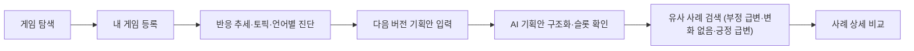
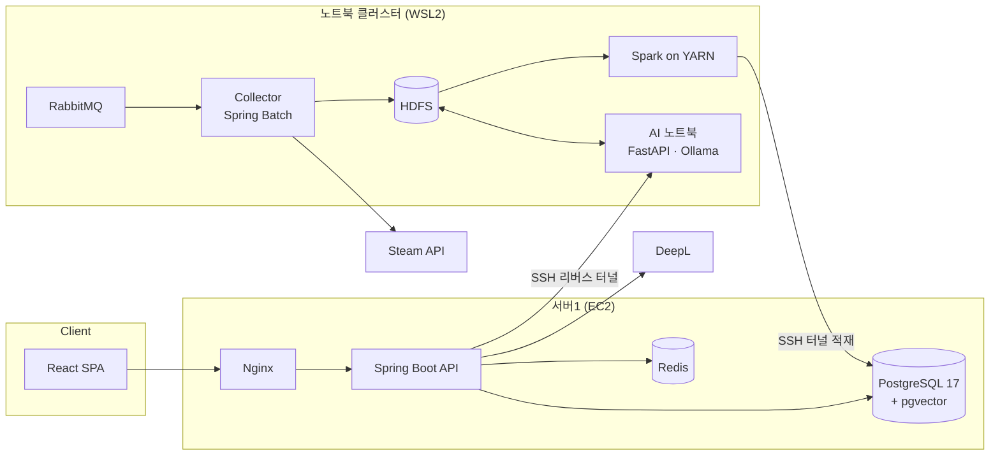
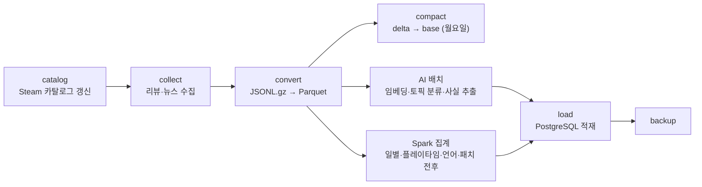
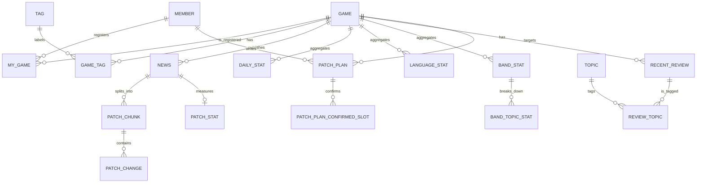

<p align="center">
  
</p>

<h1 align="center">ThisPatch — 유저의 반응을 다음 패치의 판단 근거로</h1>

> Steam 리뷰와 패치 이력을 분산 처리해, 출시 이후 운영 단계의 게임 개발사가 **내 게임의 유저 반응을 진단**하고 **다음 패치를 정할 때 유사 사례를 참고**할 수 있게 하는 게임 운영 진단 플랫폼

**ThisPatch(디스패치)** 는 출시는 했지만 데이터 분석 인력이 없는 중소·인디 개발사가 리뷰를 눈으로 읽는 것 외에는 유저 반응을 볼 방법이 없다는 문제에서 출발했습니다. 다국어 Steam 리뷰와 패치노트를 Hadoop·Spark 클러스터에서 처리하고, 불만이 어디에 있고 어떤 집단에서 부정 반응이 커지는지, 비슷한 장르에서 같은 변경을 한 게임이 어떤 반응을 받았는지를 나란히 보여 줍니다.

ThisPatch는 예측이나 처방을 하지 않습니다. **진단·비교·근거 제시**까지가 시스템의 역할이고, 결정은 개발사가 합니다.

---

## 📋 목차

- [프로젝트 소개](#-프로젝트-소개)
- [주요 기능](#-주요-기능)
- [사용자 이용 흐름](#-사용자-이용-흐름)
- [주요 화면](#-주요-화면)
- [시스템 아키텍처](#-시스템-아키텍처)
- [데이터 파이프라인](#-데이터-파이프라인)
- [핵심 도메인 관계](#-핵심-도메인-관계)
- [핵심 기술](#-핵심-기술)
- [기술 스택](#-기술-스택)
- [프로젝트 구조](#-프로젝트-구조)
- [시작하기](#-시작하기)
- [관련 문서](#-관련-문서)
- [팀원](#-팀원)

---

## 🎮 프로젝트 소개

### 왜 ThisPatch인가요?

- 다국어로 쏟아지는 대량의 리뷰를 사람이 직접 읽고 분류하기 어렵습니다.
- Steam 누적 평점은 한 번 악화되면 회복이 오래 걸리고, 신규 유입에도 영향을 줍니다.
- 다음 패치가 어떤 반응을 받을지 가늠할 때 참고할 과거 사례를 체계적으로 찾을 수 없습니다.
- 부정 사례만 보면 판단이 왜곡됩니다. 무난했던 사례와 긍정적이었던 사례도 함께 봐야 합니다.

ThisPatch는 이 과정을 두 가지 질문으로 정리합니다.

| 질문                             | 기능                                                         |
| -------------------------------- | ------------------------------------------------------------ |
| **지금 우리 게임은 어떤 상태인가** | 반응 추세 타임라인, 플레이타임·토픽 분석, 리뷰 원문, 언어별 분석 |
| **다음 패치를 어떻게 정할까**      | 기획안 구조화, 유사 패치 사례 검색, 사례 상세 비교               |



| 구분          | 내용                                                         |
| ------------- | ------------------------------------------------------------ |
| 프로젝트 기간 | 2026.08 ~ 2026.10                                             |
| 서비스 대상   | 출시 이후 운영 단계의 중소·인디 게임 운영팀·PM, 기획자·밸런스 디자이너 |
| 핵심 가치     | 대량 리뷰의 구조화, 패치 전후 반응의 비교, 판단 근거의 원문 추적 |

### 하지 않는 것

- "이 패치를 내면 평점이 떨어진다"는 인과 예측
- "기획을 이렇게 바꿔라"는 처방
- 언어를 국가·지역으로 환산하거나, 리뷰 수정을 게임 이탈로 단정하는 해석

---

## ✨ 주요 기능

### 1. 게임 탐색과 내 게임 등록

- 게임 이름 검색, 장르·개발사·출시연도·리뷰 수 범위 필터로 Steam 게임을 찾습니다.
- 리뷰 수 많은 순, 긍정률 낮은 순, 반응 변화 큰 순, 최신순으로 정렬합니다.
- 검색 조건은 URL에 유지되어 상세 화면에서 돌아와도 마지막 검색이 복원됩니다.
- 관심 있는 게임을 "내 게임"으로 등록해 다시 모아 볼 수 있습니다.

### 2. 반응 추세 타임라인

- 리뷰 **수정일 기준**으로 일별 긍정률을 집계하고, 첫 작성 리뷰와 수정 리뷰를 별도 채널로 나눠 보여 줍니다.
- 차트 위에 패치 시점을 마커로 표시하고, 마커를 선택하면 패치노트 원문과 번역을 확인합니다.
- 현재 보고 있는 차트 구간을 AI가 요약합니다(AI 구간 요약).

### 3. 플레이타임·토픽 분석

- 플레이타임 구간(0–2시간 ~ 100시간 이상)별로 리뷰를 나누어 어떤 집단에서 부정 반응이 커지는지 확인합니다.
- 밸런스, 버그·성능, UI·조작, 운영·서버, 가격·과금 5개 토픽의 언급률을 긍정·부정으로 나눠 보여 줍니다.
- AI 대표 반응 요약과 반복적으로 관찰된 표현을 제공하고, 표본이 부족하면 요약을 건너뛰고 원문을 보여 줍니다.

### 4. 리뷰 원문과 언어별 분석

- 최근 대표 리뷰와 전체 리뷰를 토픽·언어·첫 작성/수정·도움됨·플레이 이력으로 필터링합니다.
- 리뷰마다 DeepL 번역을 요청할 수 있습니다.
- 언어별 리뷰 비중과 긍정률을 비교하고, 언어별 AI 대표 리뷰 요약을 확인합니다.

### 5. 기획안 구조화

- 다음 버전 기획안을 자유 텍스트로 입력하면 AI가 변경 대상과 종류를 판별합니다.
- 시스템이 이해한 내용을 재진술해 보여 주고, 사용자는 고유명사와 변경 슬롯(대상·속성·방향·범위·변경 폭·적용 범위·변경 종류)을 직접 수정합니다.
- 확정한 슬롯은 유사 사례 검색에 그대로 반영되고, 기획안 내역에 저장되어 나중에 다시 검색할 수 있습니다.

### 6. 유사 패치 사례 검색과 비교

- 기획안과 같은 축의 과거 패치를 pgvector 벡터 검색으로 찾습니다.
- 결과를 **부정 급변 · 변화 없음 · 긍정 급변** 세 결과군으로 나눠, 부정 사례만 보고 판단이 치우치지 않게 합니다.
- 사례 상세에서는 기획안과 해당 패치의 공통점·차이점, 패치노트 원문/번역, 패치 전후 긍정률 변화, 평소 패치 주기와 당시 운영 조건을 함께 비교합니다.

---

## 👥 사용자 이용 흐름

| 운영팀·PM (진단)                      | 기획자·밸런스 디자이너 (다음 패치 준비)       |
| ------------------------------------- | --------------------------------------------- |
| 회원가입·로그인                       | 진단 중인 게임에서 "기획안 입력"              |
| 게임 검색 후 내 게임 등록             | 다음 버전 기획안 작성                         |
| 반응 추세에서 패치 전후 긍정률 확인   | AI 재진술·변경 슬롯 확인 및 수정              |
| 플레이타임·토픽별로 불만 지점 좁히기  | 세 결과군의 유사 사례 검색                    |
| 리뷰 원문·언어별 반응으로 근거 확인   | 사례 상세에서 공통점·차이점·운영 조건 비교    |
|                                       | 기획안 내역에서 지난 기획안 다시 검색         |

---

## 🖥️ 주요 화면

### 1. 랜딩

> **추가할 GIF — `docs/screenshots/01-landing.gif`**<br>
> 히어로 → "패치는 끝났습니다. 그런데, 유저의 마음도 달라졌을까요?" 타이핑 애니메이션과 차트 → 01·02 섹션 스크롤 순서를 담아 주세요.

### 2. 게임 탐색


게임 이름과 다중 필터로 분석할 게임을 찾고, 카드에서 긍정률과 최근 패치를 바로 비교합니다. 관심 있는 게임은 내 게임으로 등록합니다.

### 3. 반응 추세


수정일 기준 일별 긍정률을 첫 작성·수정 채널로 나누어 보고, 패치 시점과 반응 변화를 한 화면에서 맞춰 봅니다.

### 4. 플레이타임 · 토픽


플레이타임 구간별로 5개 토픽의 긍정·부정 언급률을 비교해, 어떤 유저 집단에서 어떤 불만이 커지는지 좁혀 갑니다.

### 5. 리뷰와 언어별 분석


요약에서 끝나지 않고 원문까지 확인할 수 있습니다. 다국어 리뷰는 DeepL로 번역해 읽습니다.

### 6. 기획안 구조화


AI가 기획안을 변경 슬롯으로 구조화하고, 사용자가 시스템의 이해를 확인·수정한 뒤에만 유사 사례 검색으로 넘어갑니다.

### 7. 유사 사례 검색과 사례 상세 비교


같은 축의 과거 패치를 결과군별로 나눠 보여 주고, 사례 상세에서 내 기획안과의 공통점·차이점과 당시 반응을 비교합니다.

### 8. 내 게임 · 기획안 내역 · 마이페이지


---

## 🏗️ 시스템 아키텍처



- React 클라이언트는 Nginx를 거쳐 Spring Boot REST API와 통신합니다.
- 리뷰·뉴스 수집과 Spark 배치는 노트북 5대로 구성한 Hadoop 클러스터(NameNode·YARN RM 1대, DataNode·NodeManager 4대)에서 실행합니다.
- GPU 노트북(RTX 4070 8GB)은 HDFS 클라이언트로 임베딩·토픽 분류 배치를 수행하고, 요청형 AI API를 SSH 리버스 터널로 서버1에 노출합니다.
- Spark가 집계 결과를 서버1 PostgreSQL에 적재하면, 백엔드는 이 데이터와 AI API를 조합해 응답합니다.
- Redis는 AI 요약 캐시와 Steam 로그인 일회용 코드를 관리합니다.

---

## 🔄 데이터 파이프라인

평일 09:05(KST)에 `infra/scripts/24-pipeline.sh`가 아래 단계를 순서대로 실행합니다.



| 단계     | 담당 모듈                | 내용                                                                                       |
| -------- | ------------------------ | ------------------------------------------------------------------------------------------ |
| 카탈로그 | `catalog`                | 약 18.5만 개 Steam 앱과 태그를 매일 갱신해 `game`·`tag`·`game_tag`에 반영                  |
| 수집     | `collector`              | Spring Batch 원격 파티셔닝으로 워커 4대가 각자의 IP에서 리뷰(`filter=updated`)·패치 공지 수집 |
| 변환     | `spark`                  | `(recommendationid, updated_ts)` 기준 중복 제거 후 Parquet 저장, 규칙 기반 패치 판별        |
| 집계     | `spark`                  | 일별(수정일 기준, 첫 작성/수정), 플레이타임 구간, 토픽, 언어, 패치 전후 7일 통계             |
| AI 배치  | `ai`                     | EmbeddingGemma 임베딩, 5개 토픽 다중 라벨 분류, Qwen3.5로 패치 변경 사실 추출                |
| 적재     | `spark` (`*ToPostgres`)  | FK 순서대로 서비스 DB에 적재                                                               |

---

## 🧩 핵심 도메인 관계

> 아래 다이어그램은 Flyway 마이그레이션(`backend/src/main/resources/db/migration`)을 기준으로 주요 테이블만 정리한 **개념 관계도**입니다. 전체 컬럼을 표현하는 물리 ERD는 아닙니다.



---

## 🔑 핵심 기술

### Hadoop 클러스터 기반 분산 수집

1. 마스터 노트북의 매니저가 서비스 DB의 수집 대상 게임을 파티션으로 나눠 RabbitMQ로 워커에 전달합니다.
2. 각 워커는 자신의 IP에서 Steam API를 초당 1회 호출하고, 403·429·5xx 응답에는 백오프를 적용합니다.
3. 수집한 페이지는 중간 저장 없이 HDFS 랜딩 영역에 JSONL.gz로 기록합니다.

### 수정일 기준 반응 집계

1. Steam 리뷰는 작성 후 수정될 수 있어, 작성일만 보면 패치 이후의 태도 변화를 놓칩니다.
2. 리뷰를 `timestamp_updated` 기준으로 집계하고, 처음 작성한 리뷰와 수정한 리뷰를 별도 채널로 분리합니다.
3. 패치 시점은 Steam 공지 게시 시각을 KST 날짜로 변환해 정하고, 패치 전후 7일의 긍정률을 비교합니다.

### 리뷰 토픽 분류와 패치 변경 추출

1. 패치 공지를 청크로 나누고 EmbeddingGemma-300m으로 512차원 임베딩을 생성합니다.
2. 리뷰 임베딩에 토픽별 로지스틱 회귀 분류기 5개를 적용해 다중 라벨 토픽을 부여합니다.
3. 로컬 Qwen3.5-9B(Ollama)가 패치 청크에서 변경 대상·속성·수치·조건을 추출하고, 근거 문장 인용으로 결과를 검증합니다.
4. AI 노드는 DB에 직접 쓰지 않고 HDFS의 `_SUCCESS` 마커로 결과를 넘겨, 적재는 Spark가 담당합니다.

### 유사 패치 사례 검색

1. 사용자가 확정한 기획안 슬롯을 쿼리 임베딩으로 변환합니다.
2. pgvector **HNSW(cosine)** 인덱스로 `patch_chunk`에서 후보 30개를 찾고, 패치 단위로 중복을 제거합니다.
3. 패치 전후 긍정률 변화(±3%p)를 기준으로 부정 급변·변화 없음·긍정 급변 결과군으로 나눕니다.
4. `ef_search`는 환경 변수 `PATCH_SEARCH_EF_SEARCH`로 조정하고 검색 트랜잭션마다 `SET LOCAL`로 적용합니다.

### AI 요약 응답의 안정성

- 반응 추세·리뷰 요약은 로컬 Qwen을 먼저 사용하고, 장애가 있거나 45초 안에 응답하지 않으면 SSAFY GMS(gpt-4.1)로 대체합니다.
- 요약 결과는 Redis에 캐시합니다.
- 프론트엔드는 AI 요약과 리뷰 원문을 별도 쿼리로 불러와, 요약을 기다리는 동안에도 원문을 먼저 보여 줍니다.

### 프론트엔드 성능 개선

16개 페이지를 라우트 단위로 코드 스플리팅하고, 배포 후 오래된 청크 로딩이 실패하면 한 번 자동 새로고침하도록 복구 처리를 추가했습니다. (`vite preview`, Lighthouse 12.6.1, 중앙값, 2026-09-29 측정)

| 측정 항목                      | 변경 전                      | 변경 후                      |
| ------------------------------ | ---------------------------- | ---------------------------- |
| 초기 JS 번들                   | 1,143.50 kB (gzip 339.94 kB) | 417.55 kB (gzip 136.14 kB)   |
| 로그인 페이지 모바일 LCP       | 5.56s                        | 4.51s (−19%)                 |
| 로그인 페이지 모바일 JS 전송량 | 329.3 KB                     | 137.4 KB (−58%)              |
| 로그인 페이지 모바일 성능 점수 | 69                           | 75                           |

자세한 측정 기록은 [frontend/docs/perf](frontend/docs/perf)에 있습니다.

---

## 🛠️ 기술 스택

| 영역               | 기술                                                                              |
| ------------------ | --------------------------------------------------------------------------------- |
| Frontend           | React 19, TypeScript 6, Vite 8, React Router 8, React Compiler                    |
| State & Data       | TanStack Query 5, Zustand 5, Axios, MSW                                           |
| UI                 | Tailwind CSS 4, Recharts 3                                                        |
| Backend            | Java 17, Spring Boot 3.5, Spring Security, Spring Data JPA, Flyway, jjwt          |
| Big Data           | Hadoop 3.5 (HDFS·YARN), Spark 4.2, Spring Batch, RabbitMQ, Parquet                |
| AI                 | Python 3.13, FastAPI, sentence-transformers, EmbeddingGemma-300m, scikit-learn, Ollama (Qwen3.5-9B), SSAFY GMS |
| Database & Cache   | PostgreSQL 17, pgvector 0.8.6, pg_trgm, Redis 8.2                                 |
| External API       | Steam Web API, Steam OpenID 2.0, DeepL API                                        |
| Infra & CI/CD      | AWS EC2, WSL2, Docker Compose, Nginx, Jenkins, GitLab, Mattermost                 |
| Test               | JUnit 5, Playwright, unittest                                                     |

---

## 📁 프로젝트 구조

```text
S15P21A202/
├── frontend/          # React SPA
│   ├── e2e/           # Playwright E2E 테스트
│   └── src/
│       ├── api/       # 도메인별 API 모듈과 axios 클라이언트
│       ├── components/# 공통 UI·레이아웃
│       ├── hooks/     # 공통 훅, TanStack Query 훅
│       ├── mocks/     # MSW 핸들러와 픽스처
│       ├── pages/     # 라우트 단위 페이지
│       └── router/    # 라우트 트리와 경로 상수
├── backend/           # Spring Boot 서비스 API
├── collector/         # Spring Batch 리뷰·뉴스 수집기 (매니저/워커)
├── catalog/           # Steam 카탈로그·태그 수집
├── spark/             # Spark 변환·집계·적재 잡
├── common/            # HDFS 경로, 스키마 등 공통 정의
├── ai/                # FastAPI 요청 API와 임베딩·분류 배치
│   ├── api/
│   └── batch/
└── infra/             # 서버 Compose, Nginx, Jenkins, 클러스터 설치·파이프라인 스크립트
```

Spark와 Spring은 Jackson·Netty·Guava 버전이 충돌하므로 Gradle 멀티 모듈에서 별도 jar로 분리했습니다.

---

## 🚀 시작하기

### 요구 사항

- Node.js 24+, pnpm
- Java 17
- Docker 및 Docker Compose
- Python 3.13, CUDA 지원 GPU (AI 서버 실행 시)
- Hadoop 3.5, Spark 4.2 클러스터 (수집·배치 실행 시)

### 1. 프론트엔드

```bash
cd frontend
pnpm install
pnpm dev
```

`http://localhost:5173`에서 확인할 수 있습니다. 개발 서버는 기본적으로 MSW 모의 API를 사용하며, 실제 백엔드에 연결하려면 `VITE_ENABLE_MOCKS=false`와 `VITE_API_BASE_URL`(기본값 `/api`)을 지정합니다.

### 2. 백엔드

`backend/.env.example`을 `backend/.env`로 복사하고 `JWT_SECRET`(base64, 32바이트 이상), `AI_BASE_URL`, `DEEPL_API_KEY` 등을 채웁니다.

```bash
cd backend
docker compose up -d --wait
../gradlew bootRun --args="--spring.profiles.active=dev"   # Windows: ..\gradlew.bat
```

`docker compose`는 로컬용 PostgreSQL(pgvector)과 Redis를 실행합니다.

### 3. AI 서버

```bash
cd ai
pip install -r requirements.txt   # CUDA용 torch는 별도 설치
cd api
python -m uvicorn main:app --port 8100
```

`OLLAMA_URL`, `EMBED_MODEL_ID`, `CLASSIFIER_PATH`, `GMS_API_KEY` 등을 환경에 맞게 지정합니다.

### 4. 수집·배치 파이프라인

클러스터 설치 절차는 [infra/docs](infra/docs)를 따릅니다. 설치 후 마스터 노트북에서 하루치 파이프라인을 실행합니다.

```bash
./gradlew :spark:jar
bash infra/scripts/24-pipeline.sh daily
```

### 5. 빌드와 테스트

```bash
# frontend
cd frontend
pnpm lint
pnpm build
pnpm test:e2e

# backend · spark · collector
./gradlew :common:test :backend:test :spark:test :collector:test

# ai
python -m unittest discover -s ai/tests -v
```

### 6. 배포

`develop` 브랜치에 Push하면 Jenkins가 변경 범위를 판단해 백엔드 테스트 → Docker 이미지 빌드 → 컨테이너 교체 → 헬스 체크를 수행합니다. 프론트엔드는 `frontend/Jenkinsfile`이 빌드 결과를 릴리스 디렉터리에 배포하고 `current` 심볼릭 링크를 교체합니다.

```bash
docker compose -f infra/compose.server.yaml up -d
```

---

## 📖 관련 문서

- [기획 명세](subtask/README.md)
- [백엔드 API 문서](backend/docs/api/README.md)
- [AI 모듈](ai/README.md) · [AI 데이터 계약](ai/CONTRACT.md)
- [Spark 잡](spark/README.md) · [패치 날짜 결정](spark/PATCH_DATE.md)
- [수집기](collector/README.md)
- [인프라 문서](infra/docs)
- [프론트엔드 API 연동 가이드](frontend/docs/api-guide.md)
- [프론트엔드 E2E 테스트](frontend/e2e/README.md)

---

## 🧑‍💻 팀원

| 이름   | 담당                  |
| ------ | --------------------- |
| 김경민 | Infra · Data Pipeline |
| 김택림 | Backend               |
| 유성현 | Backend · Data        |
| 강진우 | AI                    |
| 황용진 | Frontend              |
| 권희철 | Frontend              |
