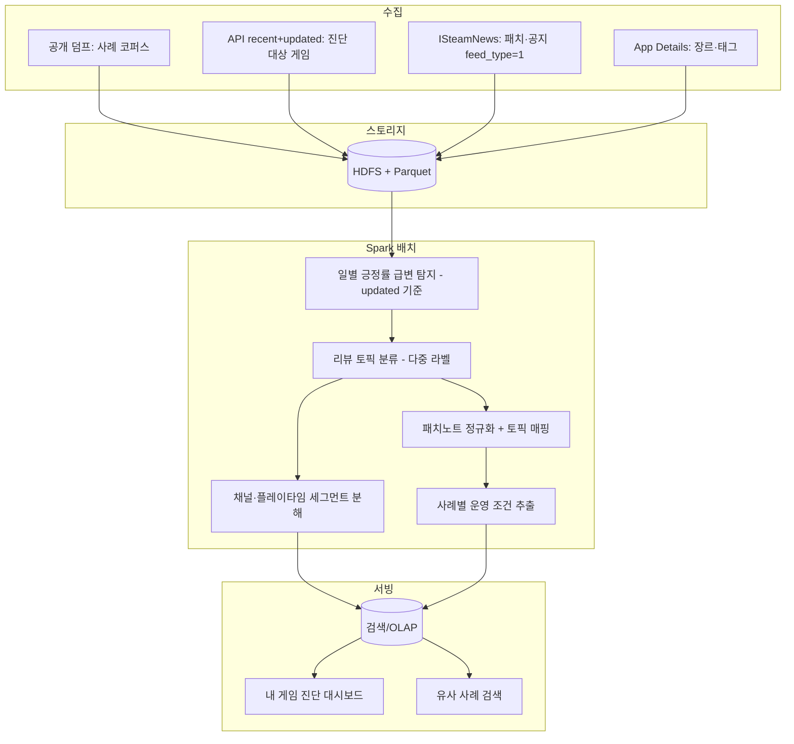

# Steam 리뷰 대규모 분산 분석 기반 게임 운영 진단 플랫폼

## 1. 프로젝트 개요

- **프로젝트명**: Steam 리뷰 대규모 분산 분석 기반 게임 운영 진단 플랫폼
- **도메인**: 빅데이터 분산 처리
- **주제 정의**: Steam 게임의 리뷰와 패치 이력을 분산 처리하여, 게임 개발사가 **출시 이후 운영 단계**에서 ① 내 게임의 유저 반응을 진단하고 ② 다음 패치를 기획할 때 유사 사례와 타사 운영 조건을 참고할 수 있게 하는 플랫폼.
- **시스템 역할**: 예측·처방이 아니라 **진단·비교·근거 제시**. 결정은 개발사가 한다.

### 1.1 한 줄 포지션

> 출시는 했는데 **데이터 분석 인력이 없는 중소·인디 개발사**를 위한 운영 진단 도구.
> 
> 
> 내 게임 리뷰에서 **불만이 어디에 있고, 어떤 집단에서 부정 반응이 커지는지**를 자동으로 뽑아내고, 다음 패치를 정할 때는 **유사 장르에서 같은 변경을 한 게임들이 어떤 반응을 받았는지**를 나란히 보여준다.
> 

### 1.2 두 가지 질문에 답한다

| 질문 | 기능 |
| --- | --- |
| **지금 우리 게임은 어떤 상태인가** | 내 게임 유저 반응 분석 / 반응 추세 타임라인 / 언어별 반응 분포 |
| **다음 패치를 어떻게 정할까** | 유사 패치 반응 사례 검색 / 사례별 운영 조건 표시 |

### 1.3 하지 않는 것

- "이 패치를 내면 평점이 떨어진다"는 인과 예측
- "기획을 이렇게 바꿔라"는 처방
- 위험 점수만으로 적용/미적용 단정
- 언어를 국가·지역으로 환산하는 해석
- 리뷰 수정을 게임 이탈로 단정하는 해석
- 커뮤니티·게임 뉴스 전면 크롤링

---

## 2. 타깃 페르소나

| 구분 | 대상 | 상황 |
| --- | --- | --- |
| **Primary** | 중소·인디 게임 **운영팀·PM** | 출시 후 운영 단계. 유저 반응을 상시 파악하고 부정 반응의 원인을 좁히고 싶으나 데이터 분석 인력이 없음 |
| **Secondary** | 기획자·밸런스 디자이너 | 다음 버전 변경안 확정 전, 유사 사례의 실제 반응을 참고하고 싶음 |

**핵심 사용 시점**: 출시 이후 운영 전 기간

---

## 3. 핵심 페인포인트

1. **내 게임 유저 반응을 체계적으로 볼 수단이 없다** — 리뷰를 눈으로 읽는 것 외에 방법이 없고, 다국어 대량 피드백은 수작업 불가
2. **패치 부작용을 사전에 가늠하기 어렵다** — 유사 역사를 체계적으로 조회할 수 없음
3. **사후 대응의 한계** — Steam 누적 평점은 악화되면 회복이 오래 걸리고 신규 유입에 영향
4. **부정 사례만 보면 의사결정이 왜곡된다** — 무난했던 사례도 함께 봐야 참고 수단이 됨

### 3.1 배경 — 스튜디오 규모에 따른 회복 여력 차이

브랜드 자산이 축적된 스튜디오는 '브랜드 후광 효과'로 소비자 관용을 누리며 복구 자원도 있다. 반면 중소·인디 스튜디오는 이러한 완충장치가 없어 패치 실패의 비용이 상대적으로 훨씬 크다.

동일 유형의 위기(과금 방식 반발)에서 EA는 단기 주가 하락 후 몇 달 내 회복했으나, 신생 스튜디오 Xaviant는 서비스를 종료했다.

> **주의**: 이 사례는 **왜 소규모 스튜디오에서 판단 근거가 더 중요한지**를 보여주는 배경이다. 본 시스템이 그러한 사례를 방지할 수 있었다는 주장은 하지 않는다.
> 

---

## 4. 기능 구성 (MVP)

### 4.1 내 게임 유저 반응 분석

개발사가 자기 게임 appid를 지정하면 상시 진단을 제공한다.

**① 불만·만족 요소 분석**

리뷰 토픽을 5대 카테고리로 다중 라벨 분류
`[밸런스/너프·버프]` `[과금/재화(BM)]` `[최적화/버그/크래시]` `[시스템/UI·편의성]` `[외부/운영 이슈]`

**② 운영 이슈 탐지**

패치 전후 두 윈도우의 토픽 비중을 비교해 **신규 등장 토픽**과 **반복 지속 토픽**을 구분한다. (별도 연구 주제로 확장하지 않음)

**③ 일별 긍정률과 채널 분해 — 핵심 진단 축**

**일별 긍정률의 기준 날짜는 `timestamp_updated`(수정일)다.** 즉 "그날 **표출된** 평가"를 집계한다.

```
일별 긍정률 (timestamp_updated 기준)
  ├─ 첫 작성분  (created == updated)
  └─ 수정분     (created <  updated)
```

**왜 작성일이 아니라 수정일인가 — 실측 근거**

스팀은 유저당 게임당 리뷰 1개만 허용하고, 다시 쓰면 기존 걸 덮어쓴다. 따라서 패치에 실망해 옛 리뷰를 고친 사람은 **작성일 기준으로는 몇 달 전 날짜로 흩어지고, 수정일 기준으로는 패치일에 모인다.**

| 날짜 | 작성일 기준 | **수정일 기준** |
| --- | --- | --- |
| 8/13 (평시) | 76.4% | 70.4% |
| **8/14 (패치일)** | 324건, **45.4%** | **505건, 33.7%** |
| 8/15 | 55.4% | 49.2% |

**수정일 기준이 패치 신호를 더 강하게 잡는다** — 표본 56% 증가, 긍정률 11.7%p 더 낮게 측정.

**수정은 오타 고치기가 아니다 — 실측**

| 수정 간격 | 비중 | 해당 구간 긍정률 |
| --- | --- | --- |
| 당일 | 10.2% | 39.8% |
| 1~7일 | 3.9% | 38.7~50.0% |
| 8~30일 | 6.5% | 52.5% |
| **31일 이상** | **79.3%** | 39.8% |

**80%가 한 달 이상 지나서 고친 것**이며, 모든 구간에서 긍정률이 전체 평균보다 낮다. **수정은 재고(再考)와 강하게 얽혀 있으므로 버리지 않고 수정일에 귀속시킨다.**

**채널별 실측 (Slay the Spire 2 / v0.111.0 패치일, 505건)**

| 채널 | 긍정률 | 플레이 이력 중앙값 |
| --- | --- | --- |
| 첫 작성분 | 46.7% | 118.8시간 |
| **수정분** | **13.9%** | **194.7시간** |

**교차검증 — 독립 지표와 방향이 일치한다**

`playtime_at_review`로 따로 나눠도 같은 결론이 나온다.

| 플레이타임 기준 | 긍정률 |
| --- | --- |
| 짧은 플레이 | 46.2% |
| **긴 플레이** | **21.0%** |

평시 구간(1,945건)에서도 재현된다(첫 작성 76.1% vs 수정 46.2%). 수정분의 67.7%가 긴 플레이 그룹인데, 첫 작성은 38.2%다.

**신호 증폭**: 평시 대비 수정 채널 4.25배, 첫 작성 1.9배. **수정 채널이 같은 사건을 2배 이상 뚜렷하게 감지한다.**

**④ 플레이타임 구간별 진단 힌트**

**"초반이냐 장기냐"는 플레이타임 축이 답한다. 채널 축은 답하지 않는다.**

| 짧은 플레이 | 긴 플레이 | 살펴볼 방향 |
| --- | --- | --- |
| 나쁨 | 괜찮음 | 초반 경험·진입 장벽 |
| 괜찮음 | **나쁨** | 장기 플레이 구간의 변경 사항 |
| 둘 다 나쁨 |  | 품질·안정성 (크래시·진행 불가) |

**채널(첫 작성 / 수정)은 "어느 창구에서 부정이 도드라지는가"만 말한다.** 첫 작성 그룹도 플레이 이력 중앙값이 118.8시간이므로 초반 경험 문제로 해석할 수 없다.

**한계 명시**

- **채널은 유저 유형이 아니다.** 첫 작성 그룹도 플레이 이력이 길다
- **수정 방향을 모른다.** 단일 스냅샷으로는 "긍정→부정 전환"과 "원래도 부정이었는데 내용만 고침"을 구분할 수 없다
- 따라서 **"기존 팬이 등을 돌렸다"가 아니라 "수정 채널의 부정 비중이 평소보다 커졌다"**까지만 말한다
- **전환 방향 판별은 일별 스냅샷을 쌓으면 가능**하다. 전날 상태와 비교하면 된다. 과거 소급은 불가
- **수정일 기준 집계는 과거 수치가 갱신된다.** 오늘 누가 3월 리뷰를 고치면 3월에서 빠지고 오늘로 옮겨온다. **일별 스냅샷을 남기고 "N월 N일 기준" 표시로 재현성을 확보**한다

> **범위 조정**: 원안의 "리뷰 및 **커뮤니티** 토픽 변화"에서 커뮤니티는 제외한다. Steam 포럼은 공식 API가 없고 크롤링이 이용약관 위반이며, 국내 게임 커뮤니티(인벤·루리웹·디시)는 Common Crawl 수집량이 각 1~19블록에 불과해 분석 규모가 되지 않음을 실측 확인했다.
> 

### 4.2 반응 추세 타임라인

이 제품의 얼굴이 되는 화면.

- 타임라인 슬라이더로 패치 전후 구간 재생
- 바 그래프: **일별 리뷰 유입량** (수정일 기준)
- 도넛 차트: 긍정/부정 분포 + **채널 분해**
- 평가 그래프에 **패치 노트 마커** 오버레이

> **제목 정정**: 원안 "게임 성장 추세"는 지표와 맞지 않는다. 바 그래프가 유저 수가 아니라 리뷰 유입량이므로 리뷰가 늘어난 게 성장은 아니다(리뷰 폭탄일 수도 있음). **"반응 추세"로 변경.**
> 
> 
> **지표 정정**: 원안의 "유저 수 증감"은 구현 불가하다. Steam은 동시접속자 **현재값만** 제공하고 이력을 제공하지 않음을 실측 확인했다(`GetNumberOfCurrentPlayers`, 키 불필요).
> 
> **확장(후순위)**: 프로젝트 기간 중 동시접속자를 일별 수집하면 그 기간 내 패치에 한해 실제 접속자 추이를 표시할 수 있다. 과거 소급은 원리적으로 불가.
> 

### 4.3 언어별 반응 분포

- `language` 필드 기준 리뷰 반응 집계
- 패치 전후 언어별 긍정률 변화 비교

> **국가 매핑 제외**: 세계지도 시각화를 하지 않는다. 언어는 국가를 대변하지 못한다(영어권 다수 국가, 중국어 화자 분산, 러시아어 사용 지역 광범위). **언어 분포 그래프로만 제시**하고 지역 해석은 하지 않는다.
> 

### 4.4 유사 패치 반응 사례 검색

기획자가 변경 초안을 자연어로 붙여넣으면 **슬롯 추출 → 재진술 확인 → 유사 장르 과거 사례 검색**.

**부정 급변 / 변화 없음 / 긍정 급변**을 함께 제시한다. 급락만 모으면 도구가 사실상 "하지 말라"가 되므로 무난·긍정 사례를 공존시킨다.

기획서 원문을 검색 쿼리로 바로 쓰지 않고, 반드시 슬롯 재진술을 사람이 확인한다.

**사례 카드에 표시하는 관측 조건**

사분면 제품을 별도로 만들지 않고, 각 사례 카드에 관측된 조건 몇 줄만 붙인다.

| 조건 | 산출 |
| --- | --- |
| 패치 빈도 | 그 게임의 평소 패치 주기 |
| 다음 공지까지 며칠 | 급변 후 첫 실제 패치까지 (**평소 주기 대비 배수로 정규화**) |
| 제목에 beta 표기 | 베타 브랜치 선행 테스트 여부 |
| 패치 전 비패치 공지 유무 | 사전 공지 존재 여부 |
| 롤백 여부 | 본문 + **문맥 조건 동시 요구** |

**정규식 주의사항 (실측)**

- 베타 판정에서 **`preview` 제외**. POE2의 `Patch Preview`(패치 예고) 3건이 베타로 오탐. `beta` 자체는 오탐 0건
- 롤백은 **되돌림 동사 + 이전 상태 참조 표현을 같은 문장에서 동시 요구**. POE2의 `Reverse Cleave`(스킬명) 오탐 제거됨

**패치노트 추출 실패 처리**: 구조화 성공률이 47~72%이므로, 실패 사례는 **"노트 정보 부족"으로 표시하고 검색 순위에서 약하게 취급**한다.

**표현 원칙**

| ❌ 금지 | ✅ 사용 |
| --- | --- |
| 모범 사례 | 무난했던 사례 |
| 이렇게 하세요 | 당시 조건은 이랬습니다 |
| 성공 요인 | 관측된 차이점 |

> **후순위**: 사분면 분류(채널 부정 비중 × 진정 기간) 기반 대조 쌍 화면. 채널 분해가 API 수집 게임에만 적용되므로(5.1 참고) 전 사례에는 붙일 수 없다.
> 

---

## 5. 데이터 정의 및 수집

### 5.1 수집 전략 — 하이브리드

**공개 덤프 3종 모두 `timestamp_updated`(리뷰 수정 시각)가 없다.**

| 데이터셋 | 리뷰 수 | `playtime_at_review` | `timestamp_updated` |
| --- | --- | --- | --- |
| Steam Dataset 2025 | 105만 | O | **X** |
| Mendeley (2020~2024) | 3,100만 | X | **X** |
| Zenodo 2017판 | 640만 | X | **X** |

**따라서 기능별로 적용 범위가 갈린다.**

| 용도 | 수집원 | 4.1 ③ 채널 분해 |
| --- | --- | --- |
| **사례 코퍼스** (급변 탐지·토픽·유사 패치) | **공개 덤프** | ❌ **불가** |
| **진단 대상 게임** (내 게임) | **API 직접** (`recent` + `updated`) | ✅ **가능** |
| 패치노트·공지 | API (`ISteamNews`) | — |

**4.1 ③(일별 긍정률의 채널 분해)은 API로 수집한 진단 대상 게임에만 적용한다.** 유사 사례 카드에는 붙일 수 없다.

**덤프 기반 사례 코퍼스의 한계**: `timestamp_updated`가 없으므로 일별 긍정률을 작성일 기준으로만 계산할 수밖에 없다. 이 경우 나중에 수정된 리뷰의 현재 상태가 작성일로 소급되어, **패치로 인한 평가 뒤집기가 급변 지점에서 사라지고 과거 날짜로 흩어진다.** 진단 대상 게임을 API로 보강하는 이유가 여기 있다.

### 5.2 수집 목표 범위 (계획)

| 항목 | 목표 |
| --- | --- |
| 대상 장르 | 3개 (동일 장르 내 비교가 원칙) |
| 대상 게임 | 60~80개 |
| 대상 기간 | 최근 24개월 |
| 예상 규모 | 게임 선정에 따라 수백만~수천만 건. **착수 후 실측값으로 갱신** |
| 게임 선정 기준 | 리뷰 볼륨 하한 이상 |

**발표 시 주의**: 예상 규모를 확정 수치처럼 말하지 않는다.

**소표본 게임 대응**: 리뷰 유입이 적은 게임은 일별 대신 **주별·월별 집계**로 낮추고 "표본 부족" 표시를 붙인다. 타깃이 인디인데 인디 게임은 리뷰가 적어 일별 진단이 불가한 경우가 있다.

### 5.3 수집 필드

| 필드 | 용도 |
| --- | --- |
| **`timestamp_updated`** | **일별 긍정률의 기준 날짜 (4.1 ③)** |
| `timestamp_created` | 채널 분해 (updated와 비교) |
| `voted_up` | 긍정/부정 |
| `playtime_at_review` | **플레이타임 구간별 진단 힌트 (4.1 ④)** + 채널 교차검증 |
| `language` | 언어별 집계 (4.3) |
| `app_release_date` | 출시 직후/라이브 구간 분리 |
| `steam_purchase`, `received_for_free`, `refunded` | 작성자 유형 힌트 |

**필수 파라미터**: `purchase_type=all` — 미지정 시 스팀 직접 구매자만 집계되어 **리뷰의 약 47%가 누락**된다 (CS2 실측: 523만 vs 981만)

**양쪽 필터**: `filter=recent`(작성일) + `filter=updated`(수정일). 실측 — `updated`는 몇 개월 전 작성 리뷰까지 가져오며 수정분 비율 28%(recent는 4.7%)

**공지 필터**: `feed_type == 1`(steam_community_announcements)만 사용. 게임 4개에서 일관되게 확인됨. `feed_type == 0`은 외부 언론 기사.

### 5.4 의도적 제외

- 커뮤니티·게임 뉴스 전면 크롤링 (약관·정합성·규모)
- 언어→국가 매핑
- 동시접속자 과거 이력 (스팀 미제공)
- **`last_played`·`playtime_forever` 기반 이탈 판정** — 값이 조회 시점 기준이라 리뷰 작성일이 오래된 사람일수록 편향이 생긴다. 실측에서 긍정 리뷰 작성자 43.8%가 "중단"으로 나오는 불합리한 결과 발생. 동일 코호트 내 상대 비교는 유효하나 제품 화면이 없어 MVP에서 제외. 일별 스냅샷이 쌓이면 재검토
- **`refunded` 기반 환불 유저 분석** — 리뷰의 0.1~0.2%만 해당(실측). 환불 유저 전체를 대표하지 않음

---

## 6. 빅데이터 분산 처리 당위성

### 6.1 근거

| 축 | 본 프로젝트 |
| --- | --- |
| **Volume** | 유사 사례 검색은 장르를 가로지르는 리뷰·패치가 필요 |
| **Variety** | 시계열 정형 + 리뷰/패치 비정형 결합 |
| **Velocity** | 일별 증분 수집 + 리뷰 수정 이력 추적 |

### 6.2 분산이 필요한 연산 / 필요 없는 연산

| 단계 | 분산 | 이유 |
| --- | --- | --- |
| 게임별 일 긍정률, 윈도우 급변 | **Spark** | 자연 파티션 키 `app_id`, 게임 간 독립 |
| 급변 구간 다국어 텍스트 전처리·토픽 | **Spark** | 행 단위 CPU 집약 |
| 채널·플레이타임 구간 세그먼트 집계 | **Spark** | 리뷰 전량 대상 조인 |
| 패치 변경점 ↔ 토픽 매핑 | **Spark** | 대량 조인·빈도 |
| 기획서 1건 검색, 대시보드 조회 | **분산 밖** | 쿼리마다 Spark를 켜지 않음 |

**당위성은 용량이 아니라 연산량에 둔다**: 게임 다수의 독립 윈도우 병렬 + 대량 다국어 텍스트 NLP.

### 6.3 심사 증빙 — 착수 전 반드시 측정

- 배치 입력 실측: `건수 / GB / 게임 수`
- **워커 수별 잡 시간 (1 vs 2 vs 4 vs 6)** ← 분산 당위성의 유일한 실측 근거

---

## 7. 아키텍처



Kafka/Flink 실시간은 확장 과제이며 MVP에 넣지 않는다.

### 7.1 급변 탐지

- PySpark Window로 게임별 **일자별 긍정률(수정일 기준)** 산출
- 급락·급등을 **같은 규칙의 양쪽 꼬리**로 탐지
- **리뷰 수 하한 필수** — 실측: 리뷰 15건인 날 z=-2.23 오탐 발생
- 패치 정렬 윈도우 **0~14일** — 실측: 패치 후 10~13일 뒤 급변 사례 확인
- 단순 3-sigma나 고정 30%p 임계값은 쓰지 않음
- 리뷰 볼륨 낮은 게임은 주별·월별 집계로 전환
- **기존에 작성일 기준으로 측정한 z-score는 수정일 기준으로 재계산 필요**

### 7.2 패치노트 정규화

- **동사 사전을 주 신호**로 사용 (구조화 성공률 47~72% 실측)
- 수치 델타는 보조 — 게임별 표기 비율이 0.2~19.5%로 편차 큼
- **`player_impact`(플레이어 유리/불리)가 핵심 매칭 축**. 숫자 증감 방향이 아님
실측 예: `Buffed Axebot: damage increased`는 적 강화이므로 플레이어에게 불리
- 추출 실패 시 **"노트 정보 부족"** 표시 + 검색 순위 하향

---

## 8. 평가 기준

| 대상 | 보는 것 |
| --- | --- |
| 급변 탐지 | 소표본 오탐, 알려진 급변 누락, 급등·급락 대칭 처리 |
| 토픽 분류 | 다중 라벨, 사람 검수 샘플과의 일치 |
| 세그먼트 | 채널 분해와 플레이타임 구간의 방향 일치 여부 (교차검증) |
| 사례 검색 | 상위 사례의 유사성 체감, 외부 이슈 혼입 여부 |
| 엔지니어링 | 처리 건수, 잡 시간, **워커 스케일**, 재현 가능성 |

**검증 세트**: The Culling(과금 패치 반발), Path of Exile 3.15(밸런스 너프 반발) 등 알려진 사례를 시스템이 급변으로 탐지하는지 확인

---

## 9. MVP 범위

**남길 것**

1. 내 게임: **수정일 기준** 일별 유입·긍정률, 패치 마커, 토픽 5종, 언어 분포, 패치 전후 비교
2. 채널 분해(첫 작성 / 수정) + **플레이타임 구간별 진단 힌트**
3. 유사 패치 검색 (무난 사례 포함, `player_impact` 축)
4. 사례 카드에 운영 조건 몇 줄
5. 딥다이브 1개: 윈도우 이상치 / 패치–리뷰 매핑 / 스케일 실험 중 하나

**후순위**

- 운영 관행 사분면 대조 쌍 화면
- 동시접속자 일별 수집
- Kafka 스트리밍 알림

**제외**

- `last_played`·`playtime_forever` 기반 이탈 판정
- 환불 유저 세그먼트 분석
- 커뮤니티 데이터

---

## 10. 알려진 한계

| 항목 | 내용 |
| --- | --- |
| **리뷰 수정 ≠ 이탈** | 수정은 **수정 채널의 부정 비중이 커진 신호**이며 게임 이탈이 아니다. 조용히 떠난 사람은 리뷰가 없어 관측되지 않음 |
| **채널 ≠ 유저 유형** | 첫 작성 그룹도 플레이 이력 중앙값 118.8시간. "신규 유저"가 아님. 초반/장기 해석은 **플레이타임 축**으로만 |
| **수정 방향 불명** | 단일 스냅샷으로는 긍정→부정 전환을 확정할 수 없음. 일별 스냅샷 축적으로만 해결(과거 소급 불가) |
| **수정일 기준 집계의 가변성** | 과거 날짜 수치가 이후 수정으로 갱신됨. 스냅샷 날짜를 함께 표시 |
| **덤프 코퍼스의 소급 오염** | 덤프는 `timestamp_updated`가 없어 작성일 기준만 가능. 평가 뒤집기가 급변 지점에서 사라짐 |
| **채널 분해 적용 범위** | **API 수집한 진단 대상 게임에만 적용.** 덤프 기반 사례 코퍼스에는 불가 |
| **동시접속자** | 과거 이력 미제공. 리뷰 유입량으로 대체 |
| **언어→국가** | 매핑하지 않음. 언어 분포로만 제시 |
| **인과관계** | 모든 산출물은 공출현 패턴. 신뢰도 수치를 인과로 발표하지 않음 |
| **운영 조건** | 처방 불가. 반례 존재(소통 공지 0건 게임이 긍정률 97.4% 최상위, 베타 75% 활용 게임이 리뷰 폭탄) |
| **대응 속도 지표** | 평소 패치 빈도가 짧은 게임은 대응이 항상 빨라 보임. **평소 주기 대비 배수로 정규화** 필수 |
| **핫픽스 ≠ 롤백** | 실측에서 두 지표는 겹치지 않았다(Helldivers 2 핫픽스 0건·롤백 2건 / STS2 핫픽스 4건·롤백 0건). 별도 지표로 다룸 |
| **과거 구간 도달** | 리뷰 유입 많은 게임은 API 페이지네이션 제약. 실측: 250페이지(2.5만 건)로 약 2개월 |
| **소표본 게임** | 타깃(인디)의 게임이 리뷰가 적어 일별 진단이 불가할 수 있음. 주별·월별 집계로 대체 |

---

## 11. 문서 이력

| 항목 | 이전 | 현재 |
| --- | --- | --- |
| **일별 긍정률 기준 날짜** | 작성일(`created`) | **수정일(`updated`)** — 패치 신호가 더 강하게 잡힘 (표본 +56%, 긍정률 11.7%p↓) |
| **수정분 처리** | 오염으로 보고 제외 검토 | **포함, 수정일에 귀속.** 실측상 80%가 31일 이상 지나 고친 재고이므로 버리면 핵심 신호를 잃음 |
| 채널 분해 위치 | 별도 기능 | **일별 긍정률의 구성 분해** |
| 진단 힌트 축 | 채널(첫 작성/수정) | **플레이타임 구간** — 채널은 초반/장기를 못 구분 |
| 채널 분해 적용 범위 | 미명시 | **API 수집 진단 대상 게임에만** |
| 세그먼트 명칭 | 기존 팬 / 신규 유저 | 첫 작성분 / 수정분 (채널 기준) |
| 타임라인 제목 | 게임 성장 추세 | **반응 추세** |
| `last_played` | 상대 비교로 유지 | **수집·MVP에서 제외** |
| 10절 표현 | 부정 전환 신호 | **부정 비중 증가 신호** |
| 베타 정규식 | `preview` 포함 | **`preview` 제외** (POE2 오탐 3건) |
| 수집 규모 | 실측 테스트값 기재 | **계획 목표로 명시**, 착수 후 실측 갱신 |
| 국가별 분석 | 세계지도 | 언어 분포 그래프 |
| 유저 수 지표 | 유저 수 증감 | 리뷰 유입량 |
| 패치 윈도우 | 0~7일 | 0~14일 |